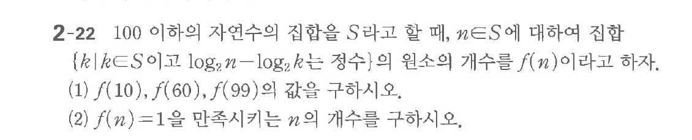

# 연습문제 2-22

## 문제

$100$ 이하의 자연수의 집합 $S$라고 할 때, $n \in S$에 대하여 집합 $\{k \mid k \in S$이고 $\log_2 n - \log_2 k$는 정수$\}$의 원소의 개수를 $f(n)$이라고 하자.
(1) $f(10), f(60), f(99)$의 값을 구하시오.
(2) $f(n)=1$을 만족시키는 $n$의 개수를 구하시오.

## 원문 문제

## 원문

