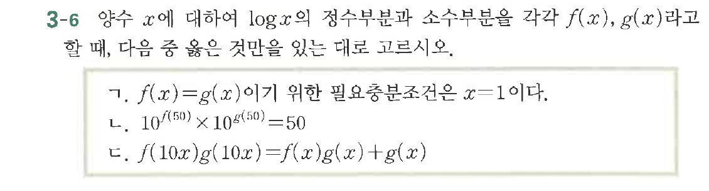
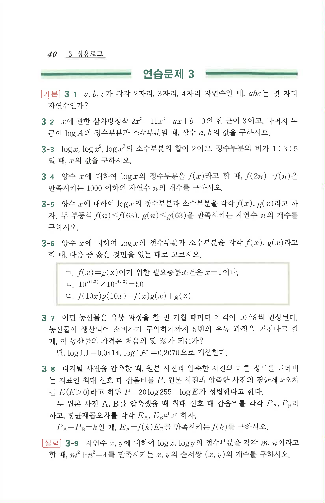

# 연습문제 3-6

## 문제

양수 $x$에 대하여 $\log_x x$의 정수부분과 소수부분을 각각 $f(x)$, $g(x)$라고 할 때, 다음 중 옳은 것만을 있는 대로 고르시오.

ㄱ. $f(x) = g(x)$이기 위한 필요충분조건은 $x=1$이다.
ㄴ. $10^{f(50)} \times 10^{g(50)} = 50$
ㄷ. $f(10x)g(10x) = f(x)g(x) + g(x)$

## 원문 문제

## 원문

