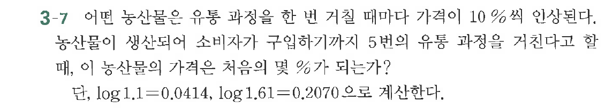

# 연습문제 3-7

## 문제

어떤 농산물은 유통 과정을 한 번 거칠 때마다 가격이 $10\%$ 인상된다.
농산물이 생산되어 소비자가 구입하기까지 5번의 유통 과정을 거친다고 할 때, 이 농산물의 가격은 처음의 몇 $\%$가 되는가?
단, $\log_{1.1} = 0.0414$, $\log_{1.61} = 0.2070$으로 계산한다.

## 원문 문제

## 원문

