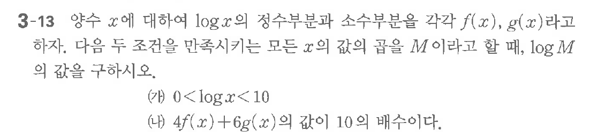

# 연습문제 3-13

## 문제

양수 $x$에 대하여 $\log x$의 정수부분과 소수부분을 각각 $f(x)$, $g(x)$라고 하자. 다음 두 조건을 만족시키는 모든 $x$의 값의 곱을 $M$이라고 할 때, $\log M$의 값을 구하시오.

(가) $0 < \log x < 10$
(나) $4f(x) + 6g(x)$의 값이 10의 배수이다.

## 원문 문제

## 원문

