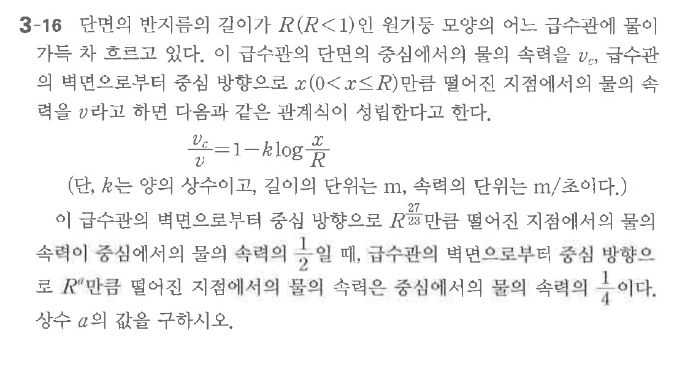

# 연습문제 3-16

## 문제

다면의 반지름의 길이가 $R(R<1)$인 원이 등심원에 몰이 갖는 좌표 좌표로 있다. 이 급수판의 점심에서의 몰의 속력 $v_c$, 급수판의 벽면으로부터 등심원 $x(0<x\le R)$ 만큼 떨어진 지점에서의 몰의 속력 $v$라고 하면 다음과 같은 관계식이 성립한다고.
$$v_c = 1 - k \log \frac{R}{v}$$
이 급수판의 벽면으로부터 등심원의 속력은 $v_c$이고, 급수판의 벽면으로부터 등심원의 속력은 $\frac{v_c}{4}$이다. 상수 $a$의 값을 구하시오.

## 원문 문제

## 원문

