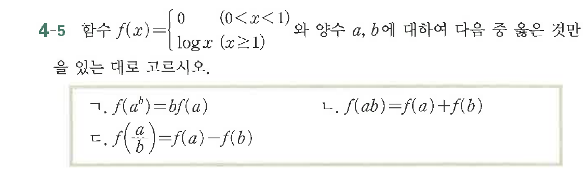

# 연습문제 4-5

## 문제

함수 $f(x) = \begin{cases} 0 & (0 < x < 1) \\ \log x & (x \ge 1) \end{cases}$ 와 양수 $a, b$에 대하여 다음 중 옳은 것만을 있는 대로 고르시오.

ㄱ. $f(a^b) = bf(a)$
ㄴ. $f(ab) = f(a) + f(b)$
ㄷ. $f(\frac{a}{b}) = f(a) - f(b)$

## 원문 문제

## 원문

