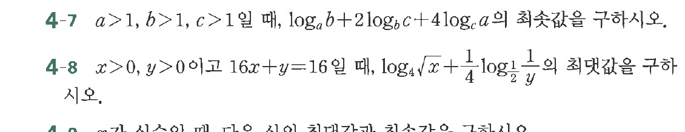

# 연습문제 4-7

## 문제

$a>1, b>1, c>1$일 때, $\log_a b + 2\log_b c + 4\log_c a$의 최솟값을 구하시오.

**연습문제 4-8**
$x>0, y>0$이고 $16x+y=16$일 때, $\log_4 \sqrt{x} + \frac{1}{4}\log_2 \frac{1}{y}$의 최댓값을 구하시오.

**연습문제 4-9**
$x$가 실수일 때 다음 식의 최댓값과 최솟값을 구하시오.

## 원문 문제

## 원문

