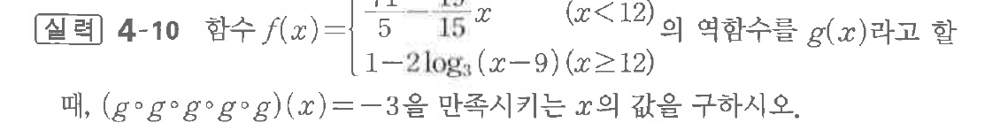

# 연습문제 4-10

## 문제

실력 4-10 함수 $f(x) = \frac{1}{5} - \frac{1}{15^x}$ ($x < 12$)의 역함수를 $g(x)$라고 할 $\frac{1}{1-2\log_3(x-9)}$ ($x \ge 12$)
때, $(g \circ g \circ g \circ g)(x) = -3$을 만족시키는 $x$의 값을 구하시오.

## 원문 문제

## 원문

