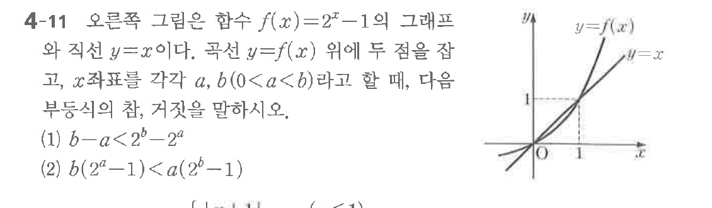

# 연습문제 4-11

## 문제

오른쪽 그림은 함수 $f(x) = 2^x - 1$의 그래프와 직선 $y = x$이다. 곡선 $y = f(x)$ 위에 두 점을 잡고, $x$좌표를 각각 $a, b(0 < a < b)$라고 할 때, 다음 부등식의 참, 거짓을 말하시오.

(1) $b - a < 2^b - 2^a$
(2) $b(2^a - 1) < a(

## 원문 문제

## 원문

