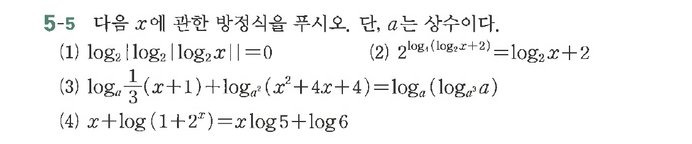

# 연습문제 5-5

## 문제

다음 $x$에 관한 방정식을 푸시오. $a$는 상수이다.
(1) $\log_2(\log_2 x) = 0$
(2) $2^{\log_1(\log_2 x+2)} = \log_2 x + 2$
(3) $\log_a\frac{1}{3}(x+1) + \log_a^2(x^2+4x+4) = \log_a(x^2+4)$
(4) $x+\log(1+2^x) = x\log 5 + \log 6$

## 원문 문제

## 원문

