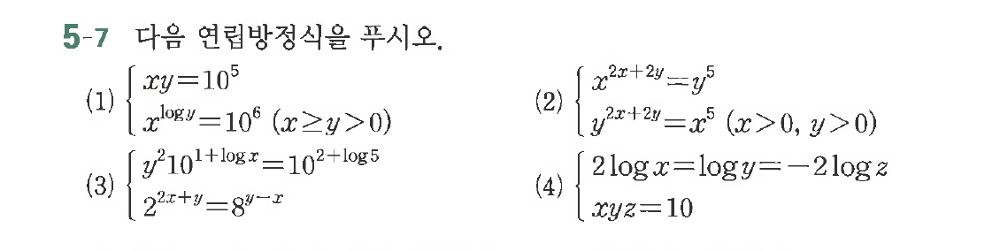

# 연습문제 5-7

## 문제

다음 연립방정식을 푸시오.
$$\begin{cases} xy = 10^5 \\ x^{\log y} = 10^6 \quad (x \ge y > 0) \end{cases}$$

다음 연립방정식을 푸시오.
$$\begin{cases} y^2 \cdot 10^{1+\log x} = 10^2 + \log 5 \\ 2^{2x+y} = 8^{y-x} \end{cases}$$

다음 연립방정식을 푸시오.
$$\begin{cases} x^{2x

## 원문 문제

## 원문

