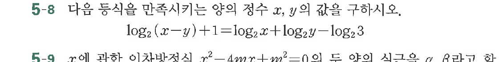

# 연습문제 5-8

## 문제

다음 등식을 만족시키는 양의 정수 $x$, $y$ 값을 구하시오.
$$\log_2(x-y) + 1 = \log_2 x + \log_2 y - \log_2 3$$

연습문제 5-9
$r$에 관한 이차방정식 $r^2 - 4mr + m^2 = 0$의 두 아의 식구를 $\alpha, \beta$라고 하여

## 원문 문제

## 원문

