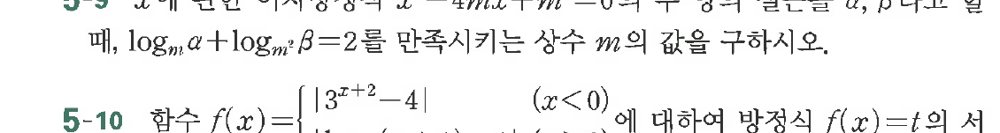

# 연습문제 5-9

## 문제

$x$에 대한 어떤 $m$이 존재할 때, $\log_m \alpha + \log_m \beta = 2$를 만족시키는 상수 $m$의 값을 구하시오.

5-10 함수 $f(x) = \begin{cases} |3^x + 2 - 4| & (x < 0) \\ \dots & \end{cases}$에 대하여 방정식 $f(x) = t$의 서로 다른 값을 $m$의 값을 구하시오.

## 원문 문제

## 원문

