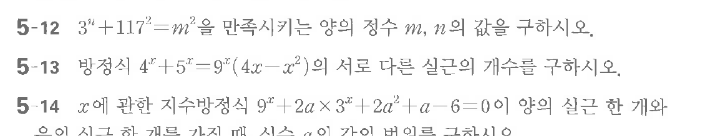

# 연습문제 5-12

## 문제

$3^x + 117 = m^2$를 만족시키는 양의 정수 $m$, $n$의 값을 구하시오.
5-13 방정식 $4^x + 5^x = 9^x(4x - x^2)$의 서로 다른 실근의 개수를 구하시오.
5-14 $x$에 관한 지수방정식 $9^x + 2a \times 3^x + 2a^2 + a - 6 = 0$이 양의 실근 한 개와 의 식 중 한 개를 가지며 실수 $a$의 값이 버림하여 구하시오.

## 원문 문제

## 원문

