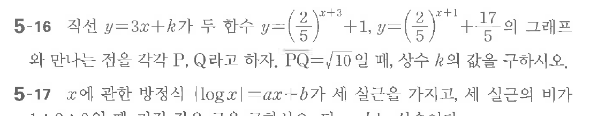

# 연습문제 5-16

## 문제

직선 $y = 3x + k$가 두 함수 $y = \left(\frac{2}{5}\right)^{x+1} + 1$, $y = \left(\frac{2}{5}\right)^{x+1} + \frac{1}{5}$의 그래프와 만나는 점을 각각 $P, Q$라고 하자. $PQ = \sqrt{10}$일 때, 상수 $k$의 값을 구하시오

## 원문 문제

## 원문

