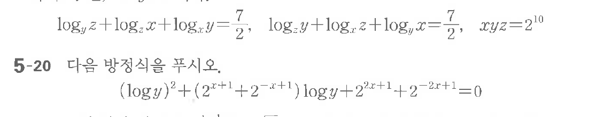
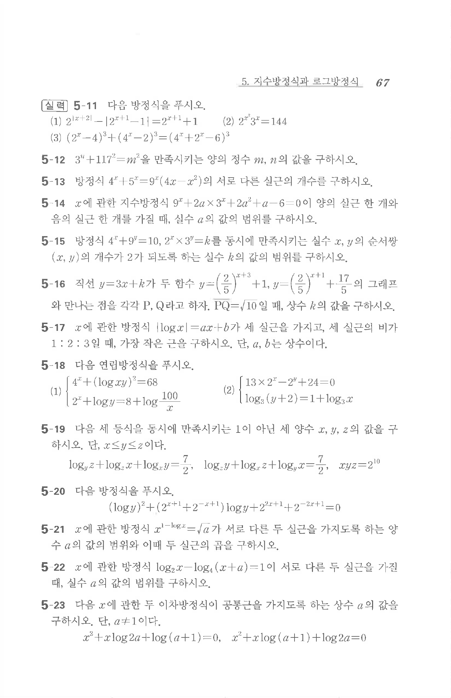

# 연습문제 5-19

## 문제

$$\log_y z + \log_z x + \log_x y = \frac{7}{2}, \quad \log_y z + \log_x y + \log_z x = \frac{7}{2}, \quad xyz = 2^{10}$$

5-20 다음 방정식을 푸시오.
$$(\log y)^2 + (2^x + 1) \log y + 2^{x+1} + 2^{-x+1} = 0$$

## 원문 문제

## 원문

