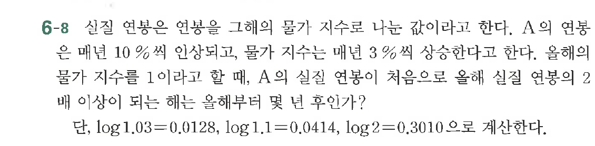

# 연습문제 6-8

## 문제

실질 연봉을 구해의 물가 지수로 나누는 값이므로 한다. A의 연봉이 지수로부터 $10\%$씩 인상되고, 물가 지수는 $3\%$씩 상승한다고 한다. 올해의 실질 연봉의 2배 이상이 되는 올해분이 몇 년 후인가?

단, $\log_{1.03}=0.0128$, $\log_{1.1}=0.0414$, $\log_{2}=0.3010$으로 계산한다.

## 원문 문제

## 원문

