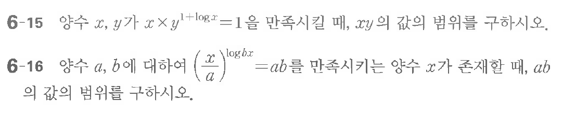

# 연습문제 6-15

## 문제

양수 $x, y$가 $x \times y^{1+\log x} = 1$을 만족시킨대, $xy$의 값의 범위를 구하시오.

연습문제 6-16

양수 $a, b$에 대하여 $\left(\frac{x}{a}\right)^{\log_b x} = ab$를 만족시키는 양수 $x$가 존재한다, $ab$의 값의 범위를 구하시오.

## 원문 문제

## 원문

