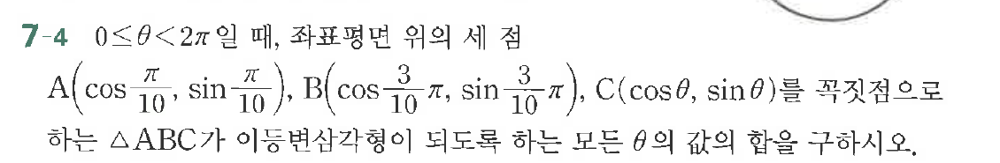

# 연습문제 7-4

## 문제

A($\cos\frac{\pi}{10}$, $\sin\frac{\pi}{10}$), B($\cos\frac{3\pi}{10}$, $\sin\frac{3\pi}{10}$), C($\cos\frac{5\pi}{10}$, $\sin\frac{5\pi}{10}$)을 꼭짓점으로 하는 $\triangle ABC$가 이등변삼각형이 되도록 하는 모든 $\theta$의 값을 구하시오.

## 원문 문제

## 원문

