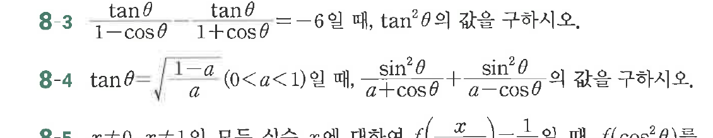

# 연습문제 8-3

## 문제

$$\frac{\tan\theta}{1-\cos\theta} \quad \text{and} \quad \frac{\tan\theta}{1+\cos\theta} = -6$$

연습문제 8-4
$$\tan\theta = \sqrt{\frac{1-a}{a}} \frac{\sin^2\theta}{a+\cos\theta} + \frac{\sin^2\theta}{a-\cos\theta}$$

연습문제 8-5
$$r \neq 0, r \neq 1 \text{일 때}, f(x) = \frac{x-1}{a} \text{일 때 } f(\cos^2\theta)$$

## 원문 문제

## 원문

