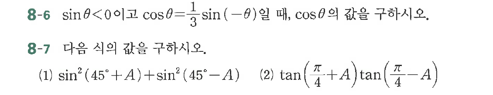

# 연습문제 8-6

## 문제

$\sin\theta < 0$이고 $\cos\theta = \frac{1}{3}$일 때, $\cos\theta$ 값을 구하시오.
(1) $\sin^2(45^\circ+A) + \sin^2(45^\circ-A)$
(2) $\tan(\frac{\pi}{4}+A) \tan(\frac{\pi}{4}-A)$

8-7 다음 식의 값을 구하시오.
(1) $\sin^2(45^\circ+A) + \sin^2(45^\circ-A)$
(2) $\tan(\frac{\pi}{4}+A) \tan(\frac{\pi}{4}-A)$

## 원문 문제

## 원문

