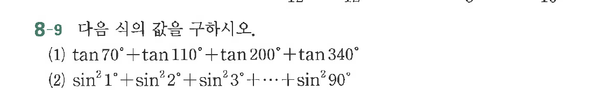

# 연습문제 8-9

## 문제

다음 식의 값을 구하시오.
(1) $\tan 70^\circ + \tan 110^\circ + \tan 200^\circ + \tan 340^\circ$
(2) $\sin^2 1^\circ + \sin^2 2^\circ + \sin^2 3^\circ + \cdots + \sin^2 90^\circ$

## 원문 문제

## 원문

