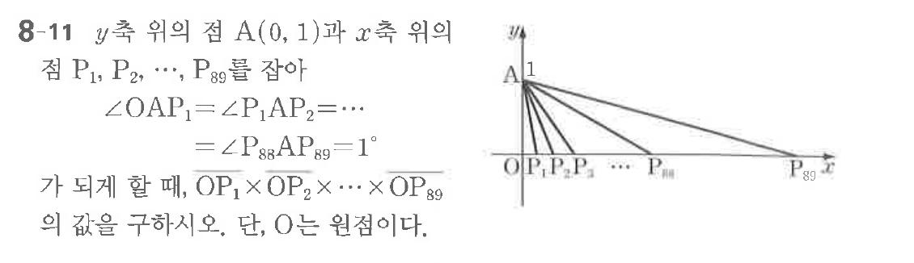

# 연습문제 8-11

## 문제

$y$축 위의 점 $A(0, 1)$과 $x$축 위의 점 $P_1, P_2, \dots, P_{89}$을 잡아 $\angle OAP_1 = \angle P_1AP_2 = \dots = \angle P_{88}AP_{89} = 1^\circ$ 가 되게 할 때, $\angle OP_1 \times \angle OP_2 \times \dots \times \angle OP_{89}$의 값을 구하시오. 단, $O$는 원점이다.

## 원문 문제

## 원문

