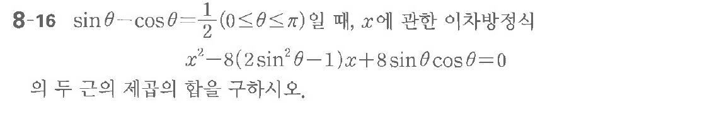

# 연습문제 8-16

## 문제

$8-16 \sin\theta - \cos\theta = \frac{1}{2}$
$(0 \le \theta \le \pi)$ 이 때, $x$에 관한 이차방정식
$x^2 - 8(2\sin^2\theta - 1) + 8\sin\theta\cos\theta = 0$
의 두 근의 곱을 구하시오.

## 원문 문제

## 원문

