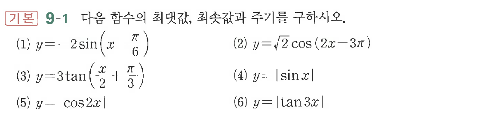

# 연습문제 9-1

## 문제

$y$ 다음 함수의 최댓값, 최솟값과 주기를 구하시오.

(1) $y = -2\sin\left(\frac{x-\pi}{6}\right)$, $y = \sqrt{2}\cos(2x-3\pi)$
(2) $y = \sqrt{2}\cos(2x-3\pi)$
(3) $y = 3\tan\left(\frac{x}{2}+\frac{\pi}{3}\right)$
(4) $y = |\sin x|$
(5) $y = |\cos 2x|$
(6) $y = |\tan 3x|$

## 원문 문제

## 원문

