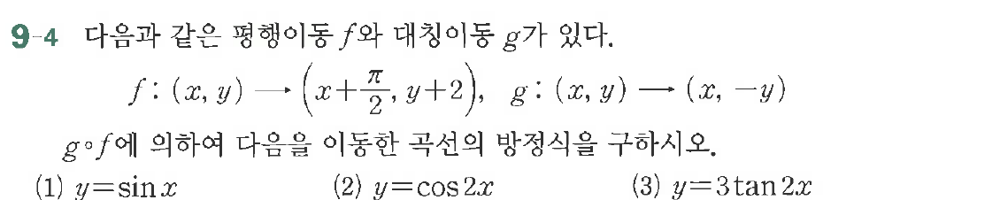

# 연습문제 9-4

## 문제

함수 $f$와 대칭이동 $g$가 있다.
$$f:(x, y) \rightarrow \left(x + \frac{\pi}{2}, y + 2\right), \quad g:(x, y) \rightarrow (x, -y)$$
$g \circ f$에 이하 다음을 이동한 곡선의 방정식을 구하시오.
(1) $y = \sin x$
(2) $y = \cos 2x$
(3) $y = 3 \tan 2x$

## 원문 문제

## 원문

