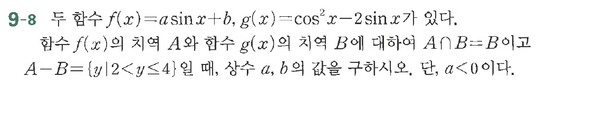

# 연습문제 9-8

## 문제

두 함수 $f(x)=a\sin x+b$, $g(x)=\cos^2 x-2\sin x$ 가 있다.
함수 $f(x)$의 지역 $A$와 함수 $g(x)$의 지역 $B$에 대하여 $A \cap B$이므로 $A-B=\{y|2<y\le 4\}$일 때, 상수 $a, b$의 값을 구하시오. 단, $a<0$이다.

## 원문 문제

## 원문

