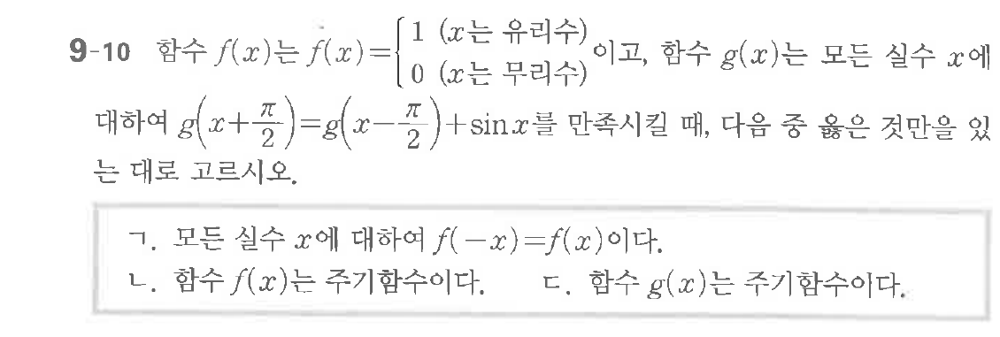

# 연습문제 9-10

## 문제

함수 $f(x)$는 $f(x) = \begin{cases} 1 & (x \text{는 유리수}) \\ 0 & (x \text{는 무리수}) \end{cases}$ 이고, 함수 $g(x)$는 $f(x)$에 대하여 $g\left(x+\frac{\pi}{2}\right) = g(x) - \frac{\pi}{2}$ 를 만족시킨대, 다음 중 옳은 것은?

ㄱ. 모든 실수 $x$에 대하여 $f(-x) = f(x)$이다.
ㄴ. 함수 $f(x)$는 주기함수이다.
ㄷ. 함수 $g(x)$는 주기함수이다.
ㄹ. 모든 실수 $x$에 대하여 $f(x) = f(-x)$이다.

## 원문 문제

## 원문

