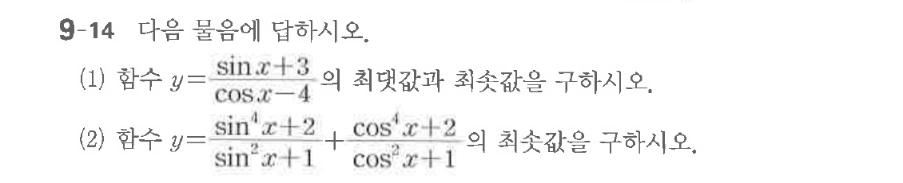

# 연습문제 9-14

## 문제

다음 물음에 답하시오.
(1) 함수 $y = \frac{\sin x + 3}{\cos x - 4}$ 의 최댓값과 최솟값을 구하시오.
(2) 함수 $y = \frac{\sin^4 x + 2}{\sin^2 x + 1} + \frac{\cos^4 x + 2}{\cos^2 x + 1}$ 의 최솟값을 구하시오.

## 원문 문제

## 원문

