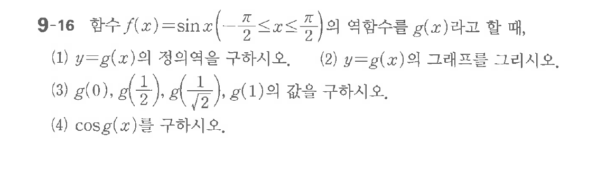

# 연습문제 9-16

## 문제

함수 $f(x) = \sin x$ ($-\frac{\pi}{2} \le x \le \frac{\pi}{2}$)의 역함수를 $g(x)$라고 할 때,
(1) $y = g(x)$의 정의역을 구하시오.
(2) $y = g(x)$의 그래프를 그리시오.
(3) $g(0), g(\frac{1}{2}), g(\frac{1}{\sqrt{2}}), g(1)$의 값을 구하시오.
(4) $\cos g(x)$를 구하시오.

## 원문 문제

## 원문

