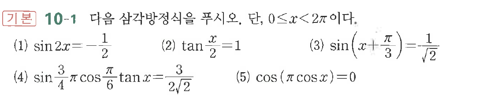

# 연습문제 10-1

## 문제

다음 방정식을 푸시오, $\tan\beta$ 역시 $0 \le x < 2\pi$이다.
(1) $\sin 2x = -\frac{1}{2}$
(2) $\tan \frac{x}{2} = 1$
(3) $\sin\left(x+\frac{\pi}{3}\right) = \frac{1}{\sqrt{2}}$
(4) $\sin\frac{3\pi}{4}\cos\frac{\pi}{6}\tan x = \frac{3}{2\sqrt{2}}$
(5) $\cos(\pi\cos x) = 0$

## 원문 문제

## 원문

