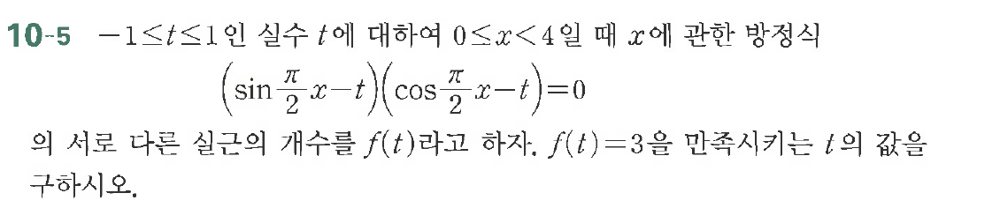

# 연습문제 10-5

## 문제

$-1 \le t \le 1$인 실수 $t$에 대하여 $\sin\left(\frac{\pi}{2}x-t\right)\cos\left(\frac{\pi}{2}x-t\right)=0$일 때 $x$에 관한 방정식 $\sin\left(\frac{\pi}{2}x-t\right)\cos\left(\frac{\pi}{2}x-t\right)=0$을 다른 실근의 개수를 $f(t)$라고 하자. $f(t)=3$을 만족시키는 $t$의 값을 구하시오.

## 원문 문제

## 원문

