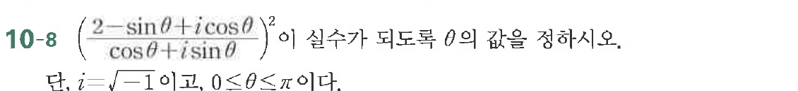
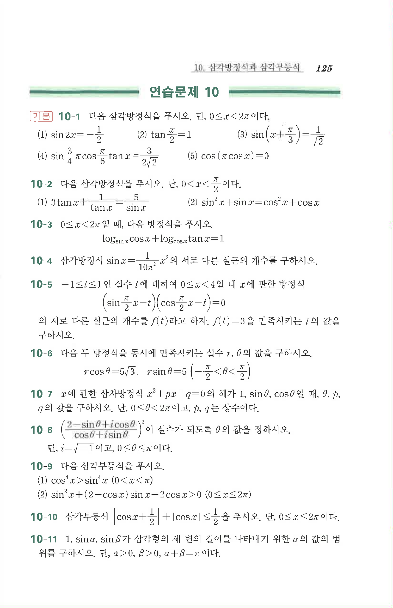

# 연습문제 10-8

## 문제

$$10 - 8 \left(\frac{2 - \sin\theta + i\cos\theta}{\cos\theta + i\sin\theta}\right)^2$$
이 실수값이 $\theta$에 의하도록 정하시오.
단, $i = \sqrt{-1}$이고, $0 \le \theta \le \pi$이다.

## 원문 문제

## 원문

