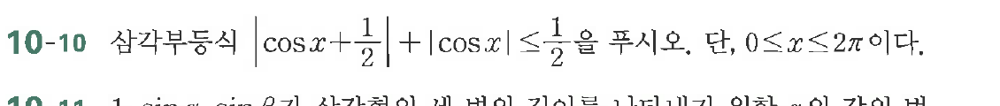

# 연습문제 10-10

## 문제

삼각부등식 $|\cos x + \frac{1}{2}| + |\cos x| \le \frac{1}{2}$을 푸시오. 단, $0 \le x \le 2\pi$이다.

연습문제 10-11
$\sin x \sin \left(\frac{\pi}{2}\right)$과 $\sin \left(\frac{\pi}{2}\right)$을 이용하여 $x$의 값을 구하시오. 단, $0 \le x \le 2\pi$이다.

## 원문 문제

## 원문

