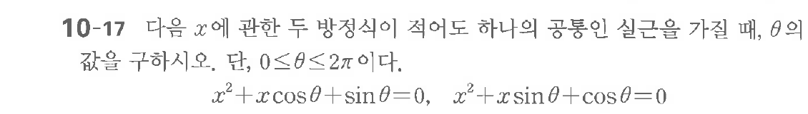

# 연습문제 10-17

## 문제

다음을 $x$에 관한 두 방정식이 서로 도 하나의 공통 실근을 가질 때, $\theta$의 값을 구하시오. 단, $0 \le \theta \le 2\pi$이다.
$$x^2 + x \cos\theta + \sin\theta = 0, \quad x^2 + x \sin\theta + \cos\theta = 0$$

## 원문 문제

## 원문

