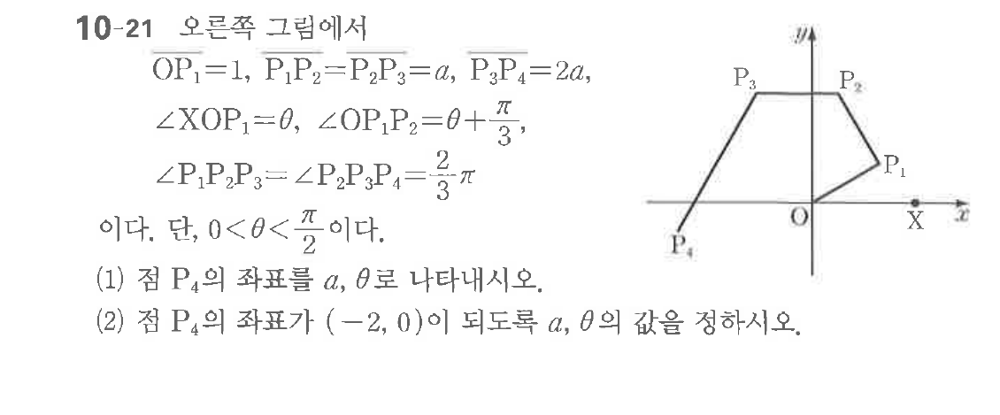

# 연습문제 10-21

## 문제

$\triangle OPQ$ 그림에서 $OP_1=1, P_2=a, P_3=2a, P_4=\frac{2}{\pi}$이다. 단, $0 < \theta < \frac{\pi}{2}$이다.

(1) 점 $P_4$의 좌표를 $a, \theta$로 나타내시오.

(2) 점 $P_4$의 좌표가 $(-2, 0)$이 되도록 $a, \theta$의 값을 정하시오.

## 원문 문제

## 원문

