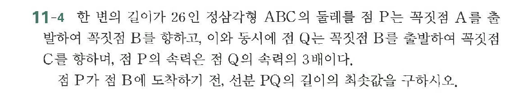

# 연습문제 11-4

## 문제

한 변의 길이가 $26$인 정사각형 $\text{ABC}$의 둘레를 점 $\text{P}$는 각형 $\text{ABC}$의 둘레를 향하여 목적점 $\text{B}$를 향하고, 이와 동시에 점 $\text{Q}$는 목적점 $\text{B}$를 출발하여 목적점 $\text{C}$를 향하며, 점 $\text{P}$의 속력은 점 $\text{Q}$의 속력의 $3$배이다. 점 $\text{P}$가 점 $\text{B}$에 도착하기 전, 선분 $\text{PQ}$의 길이를 구하시오.

## 원문 문제

## 원문

