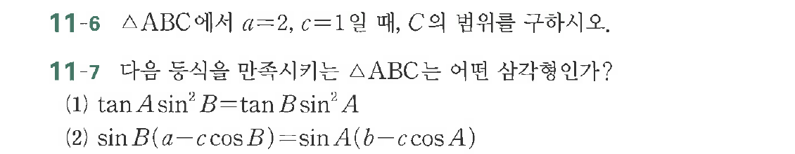

# 연습문제 11-6

## 문제

$\triangle ABC$에서 $a=2$, $c=1$일 때, $B$의 범위를 구하시오.

연습문제 11-7
$\triangle ABC$는 어떤 삼각항인가?
(1) $\tan A \sin^2 B = \tan B \sin^2 A$
(2) $\sin B(a-c\cos B) = \sin A(b-c\cos A)$

## 원문 문제

## 원문

