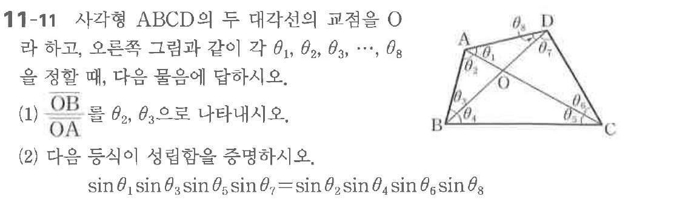

# 연습문제 11-11

## 문제

사각형 $\text{ABCD}$의 교점을 $\text{O}$라 하고, 오른쪽 그림과 같이 $\theta_1, \theta_2, \theta_3, \dots, \theta_8$을 정할 때, 다음 물음에 답하시오.

(1) $\frac{\text{OB}}{\text{OA}} = \frac{\theta_2}{\theta_1}$

(2) 다음 등식이 성립함을 증명하시오.
$$ \sin\theta_1 \sin\theta_3 \sin\theta_5 \sin\theta_7 = \sin\theta_2 \sin\theta_4 \sin\theta_6 \sin\theta_8 $$

## 원문 문제

## 원문

