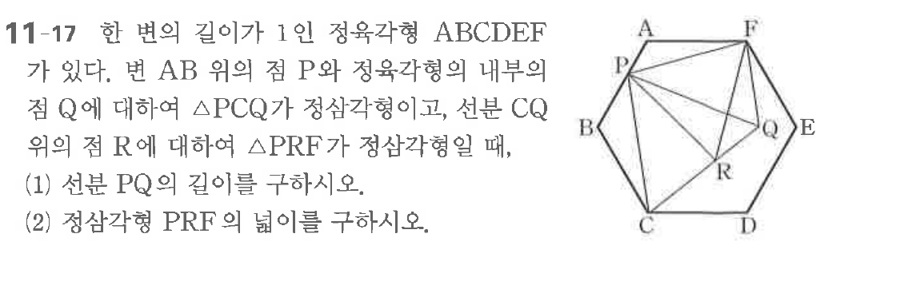

# 연습문제 11-17

## 문제

한 변의 길이가 1인 정육각형 ABCDEF가 있다. 변 AB 위의 점 P와 정육각형의 내부의 점 Q에 대하여 $\triangle PCQ$가 정삼각형이고, 선분 CQ 위의 점 R에 대하여 $\triangle PRF$가 정삼각형일 때,
(1) 선분 PQ의 길이를 구하시오.
(2) 정삼각형 PRF의 넓이를 구하시오.

## 원문 문제

## 원문

