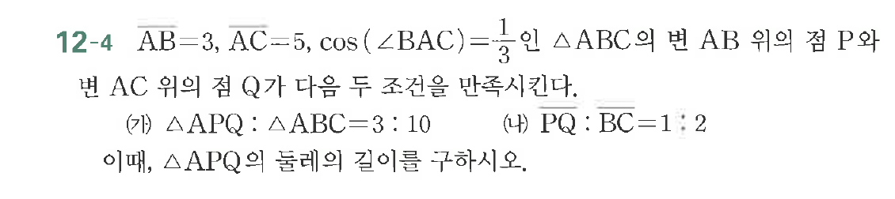

# 연습문제 12-4

## 문제

$\overline{AB}=3$, $\overline{AC}=5$, $\cos(\angle BAC)=\frac{1}{3}$인 $\triangle ABC$의 점 $AB$ 위의 점 $Q$가 다음 두 조건을 만족시킨다.

(가) $\triangle APQ:\triangle ABC=3:10$
(나) $\triangle PBQ:\triangle ABC=1:2$

이때, $\triangle APQ$의 둘레의 길이를 구하시오.

## 원문 문제

## 원문

