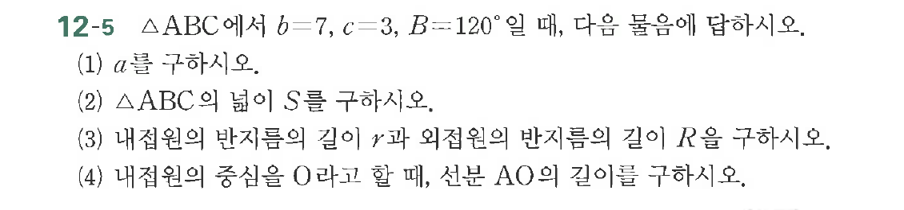

# 연습문제 12-5

## 문제

$\triangle ABC$에서 $b=7$, $c=3$, $B=120^\circ$일 때, 다음을 구하시오.
(1) $a$를 구하시오.
(2) $\triangle ABC$의 넓이 $S$를 구하시오.
(3) 내접원의 반지름의 길이 $r$과 외접원의 반지름의 길이 $R$을 구하시오.
(4) 내접원의 중심을 $O$라고 할 때, 선분 $AO$의 길이를 구하시오.

## 원문 문제

## 원문

