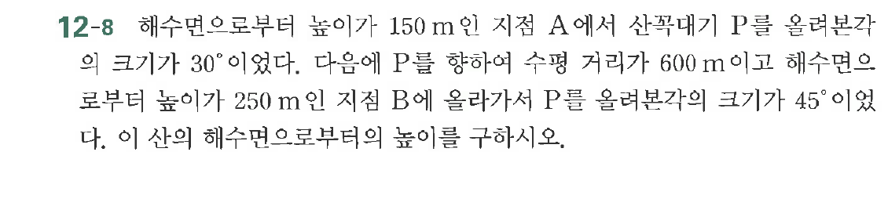

# 연습문제 12-8

## 문제

해수면으로부터 $150\text{m}$인 지점 A에서 산꼭대기 P를 올려본각이 $30^\circ$이었다. 다음에 P를 향하여 수평 거리가 $600\text{m}$이고 해수면으로부터 높이가 $250\text{m}$인 지점 B에 올라가서 P를 올려본각이 $45^\circ$이었다. 이 산의 해수면으로부터의 높이를 구하시오.

## 원문 문제

## 원문

