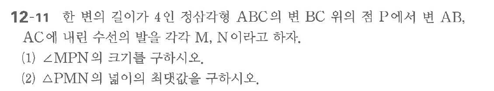

# 연습문제 12-11

## 문제

한 변의 길이가 4인 정사각형 $\text{ABC}$의 변 $\text{BC}$ 위의 점 $\text{P}$에서 $\text{AB}$, $\text{AC}$에 내린 수선의 발을 각각 $\text{M}$, $\text{N}$이라고 하자.
(1) $\angle \text{MPN}$의 크기를 구하시오.
(2) $\triangle \text{PMN}$의 넓이를 구하시오.

## 원문 문제

## 원문

