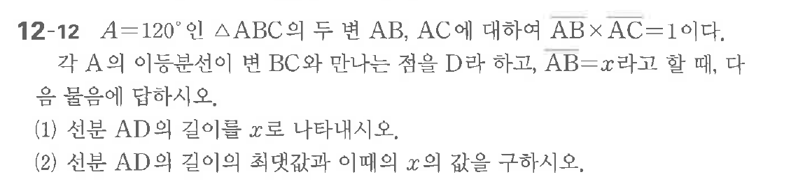

# 연습문제 12-12

## 문제

$\triangle ABC$의 두 변 $AB, AC$에 대하여 $\angle ABC = 120^\circ$인 $\triangle ABC$의 두 변 $AB, AC$에 대하여 $AB \times AC = 1$이다. 각 $A$의 이등분선이 변 $BC$와 만나는 점을 $D$라 하고, $AB=x$라고 할 때, 다음을 구하시오.

(1) 선분 $AD$의 길이를 $x$로 나타내시오.
(2) 선분 $AD$의 길이의 최댓값과 이등분선 $x$의 값을 구하시오.

## 원문 문제

## 원문

