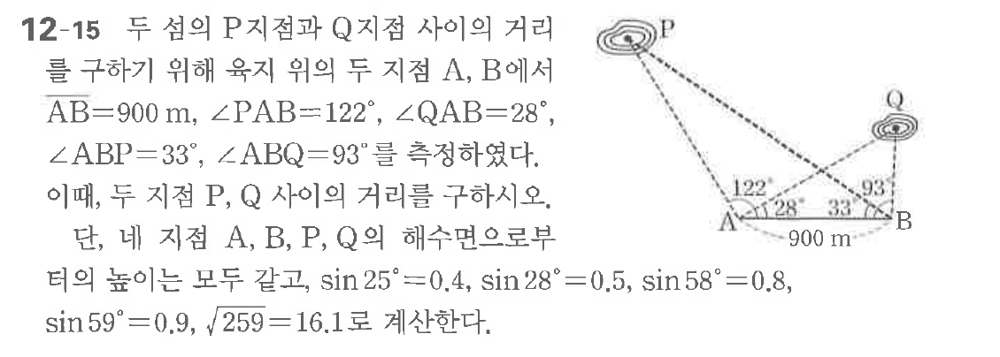
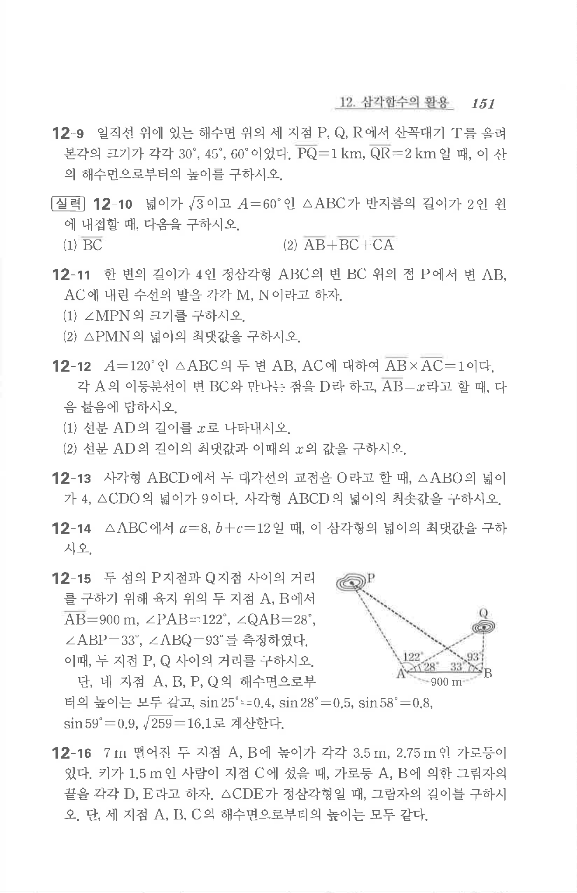

# 연습문제 12-15

## 문제

두 점 P, Q 지점과 지점 A이 거리를 구하기 위해 위치 위에서 지점 A에서 B에 $AB = 900 \text{ m}$, $\angle PAB = 122^\circ$, $\angle QAB = 28^\circ$을 측정하였다. $\angle ABP = 33^\circ$, $\angle QAB = 93^\circ$이며, 두 점 P, Q 사이의 거리를 구하시오. 다만, 지점 A, B, P, Q의 해수면으로부터의 높이는 모두 같고, $\sin 25^\circ = 0.4$, $\sin 28^\circ = 0.5$, $\sin 58^\circ = 0.8$, $\sin 59^\circ = 0.9$, $\sqrt{259} = 16.1$로 계산한다.

## 원문 문제

## 원문

