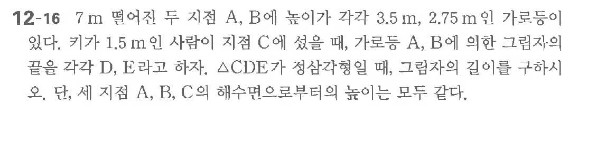

# 연습문제 12-16

## 문제

7m 떨어진 두 지점 A, B에 놓이기가 $3.5\text{m}$, $2.75\text{m}$ 간 거로다. $\triangle CDE$가 정삼각형일 때, 그림자의 길이를 구하되 A, B의 해수면으로부터의 높이는 모두 같다. 단, 세 지점 A, B의 해수면으로부터의 높이는 모두 같다.

## 원문 문제

## 원문

