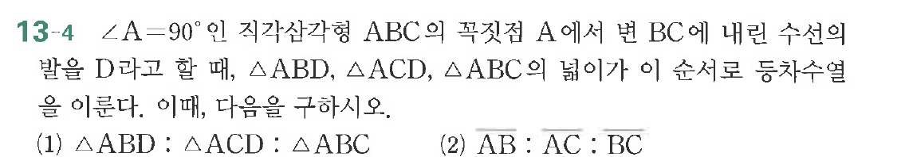

# 연습문제 13-4

## 문제

$\angle A = 90^\circ$인 직각삼각형 $\triangle ABC$에서 $\angle B$에 내린 수선의 발을 $D$라고 할 때, $\triangle ABD$, $\triangle ACD$, $\triangle ABC$의 넓이가 이른다.
(1) $\triangle ABD : \triangle ACD : \triangle ABC$ (2) $AB : AC : BC$

## 원문 문제

## 원문

