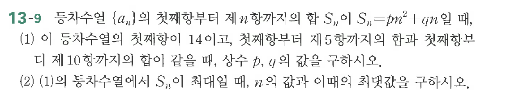

# 연습문제 13-9

## 문제

(1) 등차수열 $\{a_n\}$의 첫째항부터 제$n$항까지의 합 $S_n$이 $S_n = pn^2 + qn$일 때, $S_n$이 등차수열의 합이 14이고, 첫째항부터 제5항까지의 합과 첫째항부터 제10항까지의 합을 구하시오.

(2) (1)의 등차수열에서 $S_n$이 최대일 때, $n$의 값과 이때의 최댓값을 구하시오.

## 원문 문제

## 원문

