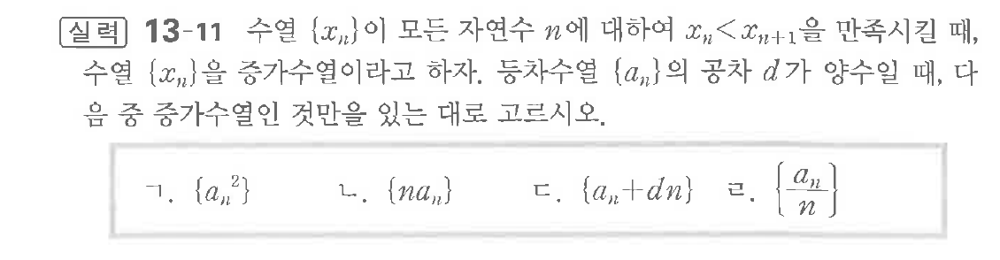

# 연습문제 13-11

## 문제

수열 $\{x_n\}$이 모든 자연수 $n$에 대하여 $x_{n+1} < x_{n+1}$을 만족시킨대, 수열 $\{x_n\}$을 증가수열이라고 하자. 등차수열 $d$가 양수일 때, 음 증가수열이 있다면 $x_n$을 증감수열이라고 하자.

ㄱ. $\{a_n\}$
ㄴ. $\{na_n\}$
ㄷ. $\{a_{n+dn}\}$

## 원문 문제

## 원문

